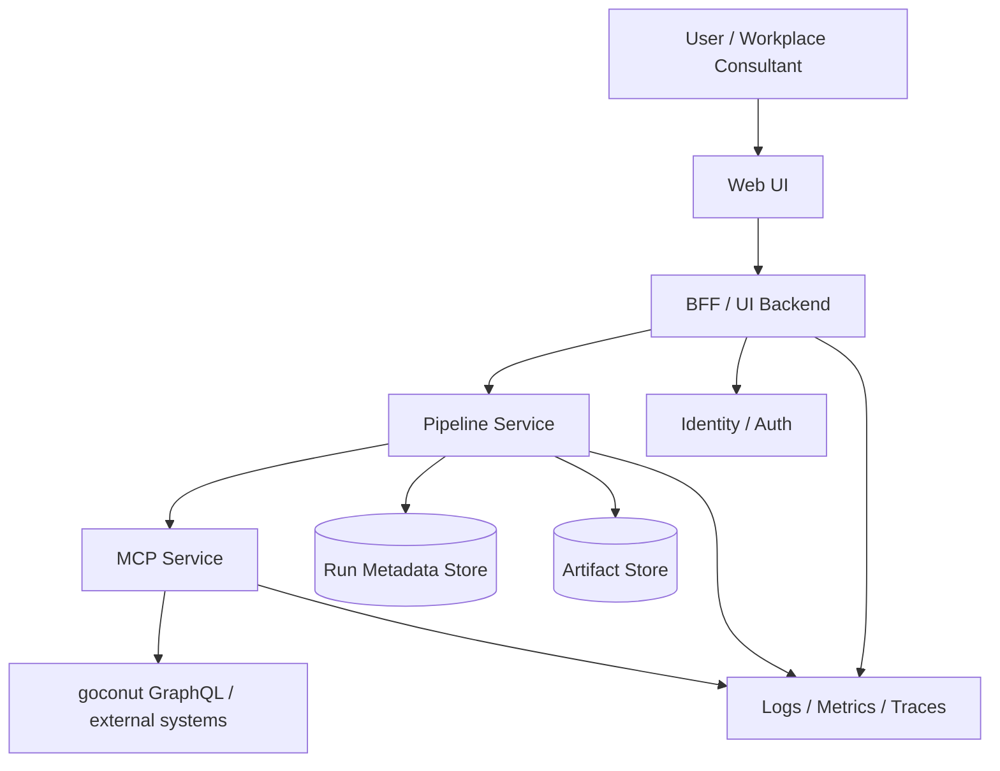
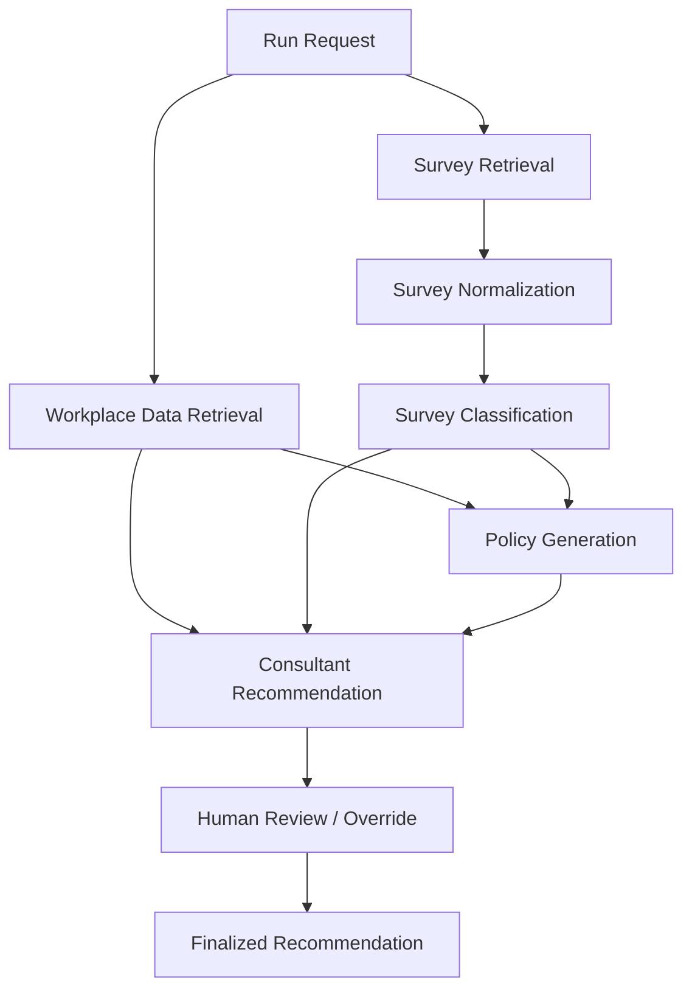

# System Architecture

## 1. Purpose

This platform supports workplace consulting through a layered microservice architecture. The system combines user-driven configuration, deterministic workplace data retrieval, AI-supported reasoning, policy generation, and consulting recommendations.

The long-term architecture separates presentation, orchestration, and integration concerns into distinct services:

- Web UI
- BFF / UI Backend
- Pipeline Service
- MCP Service
- supporting storage and observability infrastructure

## 2. Topology



## 3. Core Rule

Primary business communication path:

```text
UI -> BFF -> Pipeline Service -> MCP Service -> external systems
```

The UI must not directly orchestrate MCP calls for the main business workflow.

## 4. Layer Responsibilities

### 4.1 Presentation Layer

#### Web UI
Owns:
- run configuration
- source selection UI
- progress display
- result visualization
- policy preview
- review / override interactions

Does not own:
- orchestration
- integration logic
- business rules for policy and consulting generation

#### BFF / UI Backend
Owns:
- frontend-facing API
- user/session auth mediation
- permission checks for UI actions
- view-model shaping
- polling/subscription facade
- artifact access facade
- review/finalization endpoints
- hiding internal topology from the browser

Does not own:
- workflow orchestration
- GraphQL transport
- goconut token handling
- consulting logic

### 4.2 Workflow / Domain Layer

#### Pipeline Service
Owns:
- run lifecycle
- request validation
- workflow orchestration
- node dependency model
- survey classification
- policy generation
- consulting synthesis
- artifact creation and references
- final consulting outputs

Does not own:
- external transport details
- browser session logic
- UI-specific response shaping

### 4.3 Integration Layer

#### MCP Service
Owns:
- goconut access
- GraphQL queries and transport
- integration auth/token lifecycle
- tenant-aware external retrieval
- integration retries/timeouts
- stable typed service endpoints for workplace data
- connectivity diagnostics

Does not own:
- orchestration
- policy generation
- consulting recommendations
- UI flows

## 5. Long-Term Orchestration Model

## Current model

A linear stage pipeline:

```text
connector -> surveyClassifier -> policyGenerator -> consultant
```

## Target model

A dependency-aware workflow graph:



The system should evolve from a hardcoded sequence into a DAG/workflow model while preserving:
- explicit contracts
- validation boundaries
- central orchestration
- auditable stage outputs

## 6. Trusted vs Untrusted Boundaries

Untrusted until validated:
- browser input
- uploaded file references
- survey source data
- MCP responses
- raw model outputs

Trusted only after validation:
- validated run request
- validated normalized survey data
- validated connector outputs
- validated node outputs
- validated finalized artifacts

## 7. Storage Model

### Run Metadata Store
Recommended: PostgreSQL.

Stores:
- run ids
- tenant ids
- run status
- node status
- timestamps
- errors
- artifact references
- review/finalization state

### Artifact Store
Development:
- local filesystem

Long term:
- S3-compatible object storage or blob storage

Stores:
- connector outputs
- normalized survey data
- classification outputs
- policy artifacts
- consulting outputs

## 8. Observability

All services should emit:
- structured logs
- runId
- traceId
- tenantId
- node/stage id
- latency
- error code

Long term:
- distributed tracing across BFF -> Pipeline -> MCP
- per-node latency metrics
- model call metrics
- retry and timeout metrics

## 9. Anti-Patterns

Do not:
- let the browser orchestrate multiple backend services directly
- let the BFF become a second business orchestrator
- put GraphQL transport inside the Pipeline Service
- put consulting logic inside the MCP Service
- pass free-form prose as the primary stage contract
- split every agent into its own microservice prematurely
- use LLM-controlled tool loops for deterministic operational data retrieval
