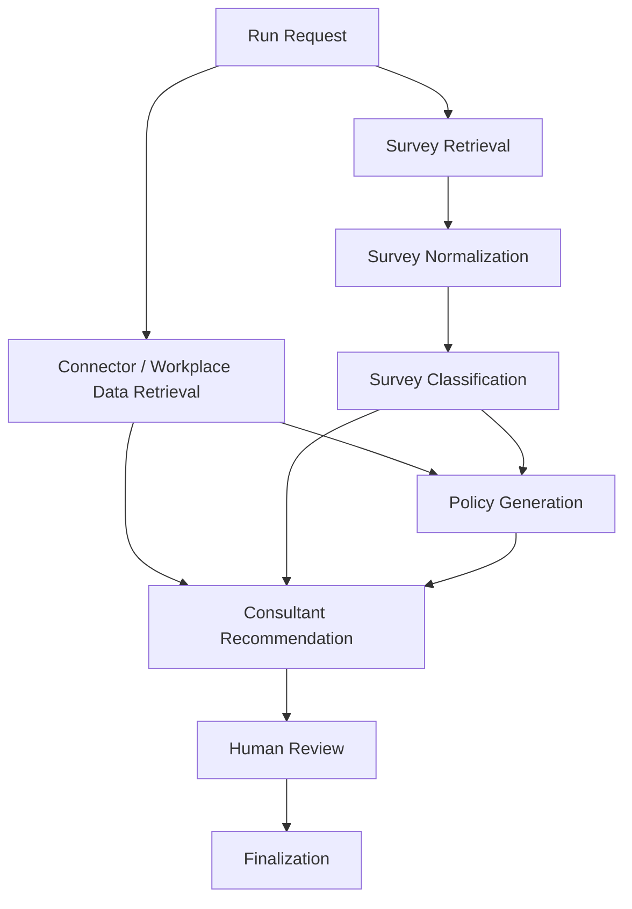

# Workflow Model

## 1. Goal

The workflow model defines how the Pipeline Service executes consulting runs over time.

The long-term system should not remain a permanently hardcoded linear list, and it should not become a free autonomous swarm. It should evolve into a dependency-aware workflow graph with explicit contracts and central orchestration.

## 2. Current Model

Current pipeline:

```text
connector -> surveyClassifier -> policyGenerator -> consultant
```

This is a valid starting point because the domain is dependency-driven.

## 3. Target Model



## 4. Node Model

Each node must define:
- node id
- input DTO
- output DTO
- output schema
- dependency list
- artifact strategy
- retry policy
- version metadata

## 5. Initial Node Set

### Connector Node
Input:
- tenant id
- building/floor scope
- date range

Output:
- workplace snapshot

### Survey Retrieval Node
Input:
- survey source

Output:
- raw survey records

### Survey Normalization Node
Input:
- raw survey records

Output:
- normalized survey records

### Survey Classification Node
Input:
- normalized survey records
- run context

Output:
- profile classifications
- confidence notes

### Policy Generation Node
Input:
- workplace snapshot
- survey classification

Output:
- policy artifacts

### Consultant Recommendation Node
Input:
- workplace snapshot
- survey classification
- policy artifacts

Output:
- findings
- recommendations
- summary

### Human Review / Finalization Node
Input:
- generated recommendation package
- human review actions

Output:
- finalized recommendation package

## 6. Execution Rules

- a node may only run when all required dependencies are satisfied
- invalid outputs stop downstream execution for dependent nodes
- retryable failures may be retried according to node policy
- non-retryable failures fail the run or block it for review
- cached outputs may be reused when inputs and versions match

## 7. Run Lifecycle

```text
queued -> running -> blocked_for_review -> succeeded
                      \-> failed
                      \-> cancelled
```

## 8. Node Lifecycle

```text
pending -> running -> succeeded
                 \-> failed
                 \-> blocked
                 \-> skipped
                 \-> cached
```

## 9. Human-in-the-Loop

Human review should become a first-class workflow concept, not an afterthought.

Typical review actions:
- approve policy
- override policy values
- request regeneration
- finalize consulting output

## 10. Why Not a Free Agent Swarm

A free autonomous swarm is a poor fit because:
- the domain has explicit dependency order
- outputs must be auditable
- recommendations must remain grounded
- validation boundaries matter
- operational data retrieval should remain deterministic

The correct model is independent node implementations under explicit orchestration.
