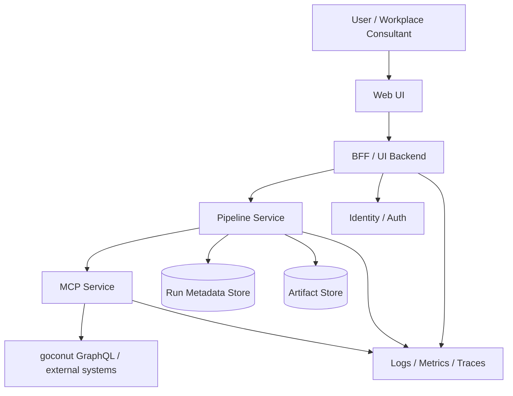

# Goconut-Workpilot: Platform Overview

## Purpose

This platform is designed to support workplace consulting through a structured, service-based architecture. It combines user-facing workflows, pipeline-based reasoning, and deterministic external data access into one coherent system.

The goal is to turn workplace operational data and employee survey inputs into structured consulting outputs such as:
- workplace classifications
- policy artifacts
- consulting recommendations
- reviewable results for human consultants

The platform is intentionally split into clear layers so that presentation, orchestration, and external integration concerns do not get mixed together.

---

## High-Level Platform Shape

```text
User / Workplace Consultant
            |
            v
         Web UI
            |
            v
    BFF / UI Backend
            |
            v
     Pipeline Service
            |
            v
        MCP Service
            |
            v
goconut / external systems
```

Supporting infrastructure:

```text
- Identity / Auth
- Run Metadata Store
- Artifact Store
- Logging / Metrics / Tracing
```
Topology



---

## Core Platform Principle

The platform follows this primary communication path:

```text
UI -> BFF -> Pipeline Service -> MCP Service -> external systems
```

This is the main business workflow.

Each layer has its own responsibility:
- the **UI** is for interaction and visualization
- the **BFF** is the frontend-facing backend boundary
- the **Pipeline Service** is the workflow and reasoning engine
- the **MCP Service** is the deterministic external data-access boundary

This separation keeps the system easier to evolve, test, secure, and operate.

---

## Platform Layers

## 1. Presentation Layer

### Components
- Web UI
- BFF / UI Backend

### Role

The presentation layer is responsible for user interaction. It allows workplace consultants or internal users to configure runs, monitor progress, review outputs, and interact with generated artifacts.

### Responsibilities

#### Web UI
The Web UI provides:
- configuration screens
- source selection
- run submission
- progress and status views
- result visualization
- artifact access
- review and feedback interactions

The UI does **not** own orchestration or integration logic.

#### BFF / UI Backend
The BFF exists as a presentation-focused backend layer between the browser and internal services.

It is responsible for:
- frontend-facing APIs
- session and user-auth mediation
- permission checks for user actions
- view-model shaping for the UI
- artifact access mediation
- polling/subscription facade
- review and override actions

The BFF should remain a **UI-oriented service**, not a second business orchestrator.

---

## 2. Workflow / Domain Layer

### Component
- Pipeline Service

### Role

The Pipeline Service is the business workflow brain of the platform.

It owns:
- request validation
- run lifecycle management
- workflow orchestration
- stage and node execution
- survey processing pipeline steps
- AI-backed classification and reasoning stages
- policy generation
- consulting recommendation generation
- artifact creation and run outputs

The Pipeline Service turns validated inputs into structured consulting results.

It should remain the single orchestration boundary for the platform’s consulting workflow.

---

## 3. Integration Layer

### Component
- MCP Service

### Role

The MCP Service is the platform’s deterministic integration boundary.

It owns:
- external system access
- goconut connectivity
- GraphQL transport details
- integration authentication and token handling
- tenant-aware retrieval of workplace data
- retries, timeouts, and integration-side error handling
- stable service endpoints for the Pipeline Service

The MCP Service should not contain consulting logic or UI logic.
Its purpose is to provide reliable access to external workplace data.

---

## Platform Communication Model

## Main workflow

1. A user starts a consulting run in the Web UI.
2. The Web UI sends the request to the BFF.
3. The BFF forwards the business request to the Pipeline Service.
4. The Pipeline Service validates the request and creates a run.
5. The Pipeline Service starts the workflow.
6. When workplace data is needed, the Pipeline Service calls the MCP Service.
7. The MCP Service retrieves data from goconut or other external systems.
8. The Pipeline Service continues downstream processing such as survey classification, policy generation, and consulting recommendation creation.
9. Artifacts and run metadata are stored.
10. The UI retrieves run state and results through the BFF.

---

## Why the platform is split this way

This architecture is intentionally layered to prevent common long-term problems.

### Without clear layering
Typical failure modes are:
- frontend becomes too smart
- orchestration leaks into UI code
- transport details leak into business logic
- external integration concerns spread across multiple services
- no clear ownership of workflow state

### With clear layering
The platform gains:
- better maintainability
- clearer team ownership
- safer changes
- better auditability
- simpler testing
- easier future scaling

---

## Long-Term Workflow Model

Today, the workflow can be understood as a pipeline of dependent steps such as:
- workplace data retrieval
- survey retrieval and normalization
- survey classification
- policy generation
- consulting recommendation generation

Long term, the system should evolve from a simple linear pipeline into a **workflow graph / DAG** with:
- explicit node dependencies
- retryable nodes
- optional branches
- human review gates
- resumability
- artifact-backed inspection of outputs

This means the platform should support **independent workflow modules**, but still keep orchestration explicit and centrally controlled.

It should **not** become an uncontrolled swarm of autonomous agents.

---

## Data and Storage

The platform uses two major storage concepts.

### Run Metadata Store
Stores structured workflow state such as:
- run identifiers
- statuses
- stage or node progress
- timestamps
- errors
- review state
- artifact references

### Artifact Store
Stores generated and inspectable outputs such as:
- normalized inputs
- stage results
- policy files
- consulting outputs
- downloadable artifacts

This separation is important because workflow state and generated files serve different purposes.

---

## Cross-Cutting Concerns

## Authentication and Authorization
The platform should separate:
- **user auth** for UI access
- **service auth** for internal service-to-service communication

## Observability
All services should support:
- structured logging
- trace identifiers
- run identifiers
- timing information
- error reporting
- metrics and tracing over time

## Validation
Runtime validation is important at service and workflow boundaries. External input, integration responses, and generated stage outputs should not be trusted until validated.

---

## What the platform is not

The platform is **not**:
- a single monolithic application
- a frontend that directly orchestrates backend services
- a GraphQL client embedded into the workflow engine
- a free-form swarm of agents making uncontrolled decisions
- a UI that talks directly to all internal services for one business flow

The platform is a layered system with explicit ownership and communication boundaries.

---

## Summary

The platform is a multi-layer workplace consulting system built around a clear separation of concerns:

- **Web UI** for interaction
- **BFF** for frontend-facing backend responsibilities
- **Pipeline Service** for workflow orchestration and consulting intelligence
- **MCP Service** for deterministic external data retrieval

The primary business path is:

```text
UI -> BFF -> Pipeline Service -> MCP Service -> external systems
```

This structure gives the organization a platform that is understandable at a high level while still being ready for long-term growth, controlled evolution, and clearer ownership across teams.
